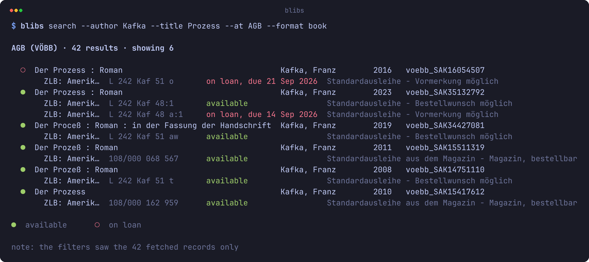
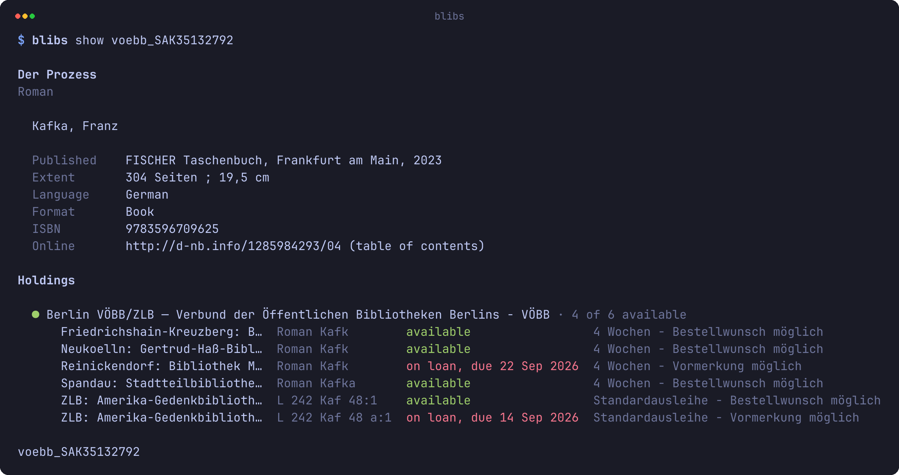

# blibs

[](https://crates.io/crates/blibs)
[](https://crates.io/crates/blibs)
[](LICENSE)

Search the libraries of Berlin and Brandenburg from the command line.

> Is this book in one of my libraries, is it in right now, and where is it on the shelf?

[Install](#install) · [Usage](#usage) · [For machines](#for-machines)



A green light means a copy is on the shelf right now, red means it is out — and where the
catalogue states nothing, `blibs` prints `?` rather than a guess. Under each hit stand the
copies of that library: where they are, their shelfmark, their status.

## Install

```sh
cargo install blibs
```

## Usage

```sh
blibs search Kafka Prozess                     # two words, both must occur
blibs search "Der Vorleser" --at HU,STABI,AGB  # one block per library
blibs search --author Kafka --year 1953 --format book
blibs show voebb_SAK13776205 --at AGB          # one title in full
blibs libraries --find grimm                   # which shortcode do I put in --at?
```

An argument in shell quotes is searched as a phrase, one without it as a word. There is no
config file — "my libraries" is `--at`, and a shell alias makes it short:

```sh
alias bl='blibs search --at STABI,HU,AGB'
```

<details>
<summary><b>All flags of <code>search</code></b></summary>

| Flag | |
| --- | --- |
| `--title`, `--author`, `--subject`, `--publisher` | field searches; they combine with AND |
| `--year YYYY` | "was running in this year" — for a journal, a year inside its run |
| `--isbn NUMBER` | ISBN or ISSN, with or without hyphens; the check digit is verified |
| `--at LIST` | my libraries: shortcodes, ISILs or branches, comma-separated |
| `--limit N` | hits per library, 1–50 (default 10) |
| `--page N` | which page (default 1) |
| `--sort KEY` | `relevance`, `year`, `title`, `author`, `availability` |
| `--format TYPE` | `book`, `ebook`, `journal`, `audio`, `video`, … |
| `--language CODE` | three letters, as the records carry them: `ger`, `eng`, `fre` |
| `--available` | only titles with a copy that is in right now |
| `--no-availability` | don't ask whether the copies are in — faster and quieter |

`--sort`, `--format` and `--language` see the fetched window only; the catalogue itself can
sort and filter by neither, and the output says so rather than implying otherwise.
`blibs search --help` explains every one of them at length.

</details>

### One title in full



The id comes from the search output and carries the catalogue it belongs to. `--at` lists
your libraries first and, for a branch, narrows the copies to that branch.

### `libraries`

123 institutions and 211 branches, compiled into the binary, so this one works offline:
`blibs libraries` lists them, `--find grimm` searches names and shortcodes, `--branches`
lists branches, `--near 52.52,13.39` or `--near HU` orders by distance, and
`blibs libraries STABI` shows one in detail.

## For machines

`--json` prints one JSON document on stdout and nothing else; errors go to stderr, also as
JSON. That is what makes `blibs` useful to an AI agent that has to answer *"Where is
Goethe's Faust on the shelf?"* — a stable schema, a `notes[]` array whose `kind` names every
limitation of an answer, and an exit code that says what happened:

| Code | |
| --- | --- |
| 0 | found at least one hit |
| 1 | searched and found nothing; also an unknown record id |
| 2 | usage error — nothing was sent |
| 3 | network error — DNS, TLS, connection refused, timeout |
| 4 | service unavailable — HTTP 429/503, backoff exhausted |
| 5 | the catalogue rejected the query |
| 6 | unexpected response — HTTP 200 whose content failed the plausibility check |

Fields may be added over time; renaming or removing one is a breaking change.

## Licence

MIT, see [`LICENSE`](LICENSE). Issues and pull requests are welcome.
